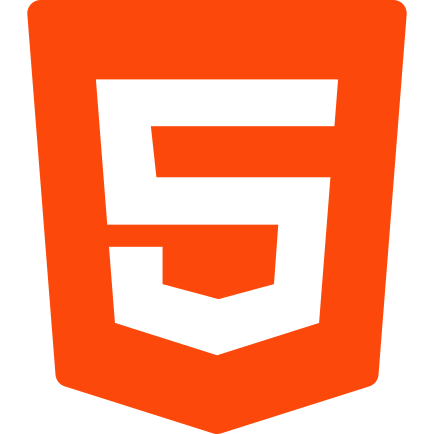
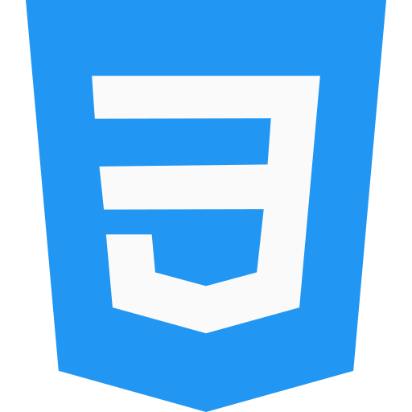

<h1 align="left">Felipe Barreto</h1>
<blockquote>
  Atualmente, sou desenvolvedor Front end com Vue JS.  
  Natural do Rio de Janeiro - RJ.  
  Sempre em busca de novos desafios que me permitam melhorar de alguma forma!
</blockquote>

<h2> 🛠️ Skills </h2>

   
   
   
  
   
   
   
   
  

<h2>:woman_technologist: Profissionais experiências</h2>
  <h3>Desenvolvedor Front-end</h3>
  <h4>&emsp;3S, Rio de Janeiro Brasil – (11/2021 - o momento)</h4>
  
&emsp;Desenvolvimento de novas features e manutenção da plataforma, utilizando o framework Vue JS, também foi é utilizado no cotidiano as ferramentas como SCSS, Vuetify e Typescript.

  
  <h3>Desenvolvedor Front-end</h3>
  <h4>&emsp;Fintask, Rio de Janeiro Brasil – (07/2021 - o momento)</h4>
  
&emsp;Desenvolvimento de novas features e manutenção da plataforma, utilizando o framework Vue JS, também foi é utilizado no cotidiano as ferramentas SCSS e Vuetify.

  <h3>Auxiliar de programação</h3>
  <h4>&emsp;Citta Telecom, Rio de Janeiro Brasil – (01/2021 - 06/2021)</h4>
  
&emsp;Desenvolver e realizar manutenções de formulários de processos, fluxos BPMN, Intranet, relatórios, manuseio de web services, etc. Tudo que a plataforma TOTVS Fluig oferece para otimizar e tornar muito mais eficaz um processo interno, ou externo.

  <h3>Progamador web</h3>
  <h4>&emsp;Citta Telecom, Rio de Janeiro Brasil – (02/2020 - 01/2021) - Estágio<h4>
  
&emsp;Programador web. Tecnologias usadas: HTML, JS, JQuery, SQL, Plataforma Fluig (ECM, BPM, Analytics).

<h2>🧐 Onde me encontrar?</h2>

 
  
  <a href="mailto:felipebarreto148@gmail.com" alt="gmail" target="_blank">
    " />
  </a>
  

<h2>Mais informações</h2>

   
  

<!--
**felipebarreto148/felipebarreto148** is a ✨ _special_ ✨ repository because its `README.md` (this file) appears on your GitHub profile.

Here are some ideas to get you started:

- 🔭 I’m currently working on ...
- 🌱 I’m currently learning ...
- 👯 I’m looking to collaborate on ...
- 🤔 I’m looking for help with ...
- 💬 Ask me about ...
- 📫 How to reach me: ...
- 😄 Pronouns: ...
- ⚡ Fun fact: ...
-->

